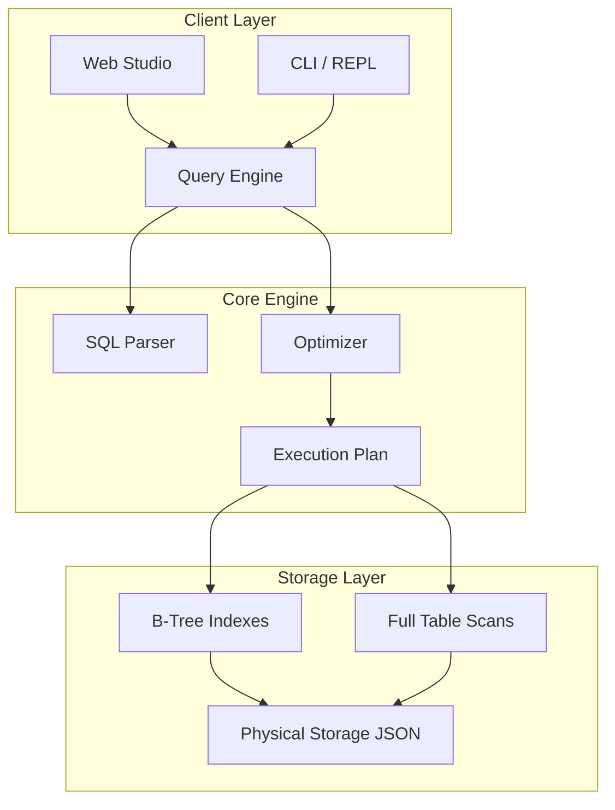

# SimpleSQLDB - RDBMS Implementation

**Pesapal Junior Dev Challenge 2026 Submission**

SimpleSQLDB is a custom Relational Database Management System (RDBMS) built from first principles in Python. It demonstrates core database engineering concepts including lexical analysis, parsing, query planning, B-Tree indexing, and physical storage management, without reliance on external database libraries (like SQLite or SQLAlchemy).

## 🚀 Key Technical Highlights

This project implements a complete database engine stack:

*   **Custom SQL Parser**: A handwritten recursive descent parser that tokenizes and parses SQL into an Abstract Syntax Tree (AST). It supports complex nested expressions and standard SQL grammar.
*   **B-Tree Indexing**: Implements balanced B-Tree structures for $O(\log n)$ primary key lookups and range queries, significantly outperforming linear scans.
*   **Query Execution Engine**:
    *   **Join Algorithms**: Implements Nested Loop Joins and Index-Aware Joins for optimized multi-table querying.
    *   **Aggregation**: Supports `GROUP BY` and `HAVING` clauses using stream-based aggregation.
*   **Transaction Safety**: Physical storage uses atomic file operations (`os.replace`) to ensure data integrity during writes (ACID durability property).
*   **N-Tier Architecture**: Clean separation between the Storage Layer, Query Engine, and Presentation Layers (REPL and Web).

## 🏗️ System Architecture



## 🛠️ Features

### Core RDBMS Capabilities
*   **DDL Operations**: `CREATE TABLE`, `CREATE DATABASE`, `CREATE INDEX`
*   **DML Operations**: `INSERT`, `UPDATE`, `DELETE`
*   **Querying**:
    *   `SELECT` with `WHERE`, `ORDER BY`, `LIMIT`
    *   `INNER JOIN` and `LEFT JOIN`
    *   Aggregates: `COUNT`, `SUM`, `AVG`, `MAX`, `MIN`
    *   `GROUP BY` and `HAVING`
*   **Constraints**: Primary Keys, Unique Keys, Foreign Keys, Not Null
*   **Introspection**: System catalogs (`.sys_tables`, `.sys_indexes`) and `EXPLAIN` query plans.

### Included Interfaces
1.  **Interactive REPL**: A command-line shell with history, syntax help, and table formatting.
2.  **Web Studio Dashboard**: A comprehensive web application (Flask) demonstrating the RDBMS in a real-world context (School ERP), featuring:
    *   CRUD Management Interfaces
    *   Visual Analytics & Reporting
    *   Raw SQL Execution Console

## 📂 Project Structure

| Module | Description |
| :--- | :--- |
| `core/parser.py` | Lexer and Parser transforming SQL strings to Command Objects. |
| `core/engine.py` | Query planner and executor; handles Joins and Aggregates. |
| `core/index.py` | B-Tree implementation for indexing. |
| `core/storage.py` | Physical I/O layer with atomic write guarantees. |
| `core/schema.py` | Table definition and type validation logic. |
| `web_demo/` | A full-stack application (School ERP) consuming the custom RDBMS. |
| `repl/` | The interactive command-line interface. |

## 🚀 Getting Started

### Prerequisites
*   Python 3.8+
*   No external database drivers required.

### Installation

```bash
git clone https://github.com/evanssamwel/RDMS-Challenge.git
cd RDMS-Challenge
pip install -r requirements.txt
```

### ⚡ Quick Start: How to Run

To run the specific applications on their designated ports, execute the following commands in your terminal:

### 1. Web Studio (Database Admin) - Port 5000
This is the professional dashboard to manage your database schemas, run SQL queries, and view execution plans.

*   **Command**:
    ```bash
    python web_demo/app_studio.py
    ```
*   **Access in Browser**: [http://127.0.0.1:5000](http://127.0.0.1:5000)

### 2. School ERP Demo - Port 5001
This is the **customer-facing application** (as required by the "Trivial Web App" challenge rule) running on top of the RDBMS. It simulates a real school management system.

*   **Command**:
    ```bash
    python web_demo/app_school.py
    ```
*   **Access in Browser**: [http://127.0.0.1:5001](http://127.0.0.1:5001)

### 3. Interactive CLI - (No Port, Terminal Only)
The command-line interface for direct SQL interaction.

*   **Command**:
    ```bash
    python -m repl.cli
    ```

---

**Summary Table:**

| Application | Command to Run | Port | URL |
| :--- | :--- | :--- | :--- |
| **Web Studio** | `python web_demo/app_studio.py` | **5000** | http://127.0.0.1:5000 |
| **School ERP** | `python web_demo/app_school.py` | **5001** | http://127.0.0.1:5001 |

## 🧪 Testing

The system includes a suite of unit and integration tests verifying parsers, constraints, and data integrity.

```bash
python -m pytest tests/
```

## 🤖 AI Attribution

In accordance with the challenge guidelines, AI tools were utilized for:
- **Boilerplate Generation**: Flask route skeletons and HTML/CSS templates.
- **Regex Patterns**: Initial drafts of complex tokenization patterns (refined manually).
- **Unit Test Scaffolding**: Generating test cases for edge conditions.
- **Documentation**: Refining the clarity and structure of this README.

*All core logic—including the parser state machine, B-Tree algorithms, and query execution pipeline—was implemented manually to demonstrate algorithmic understanding.*

## 👨‍💻 Author

**E. Samwel**
*Junior Developer Applicant 2026*
